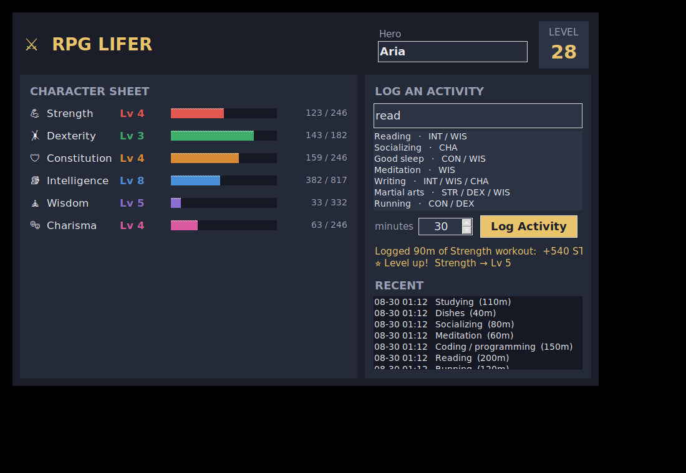
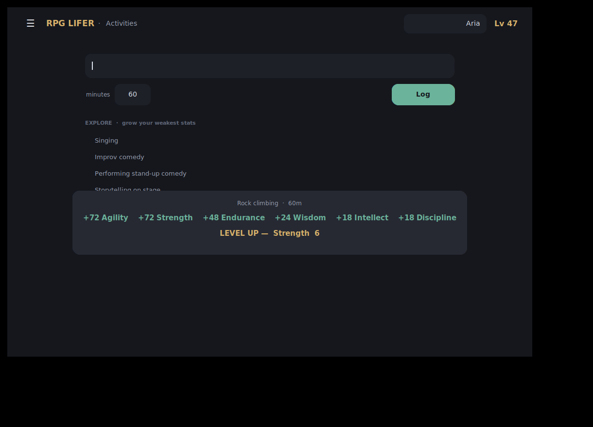
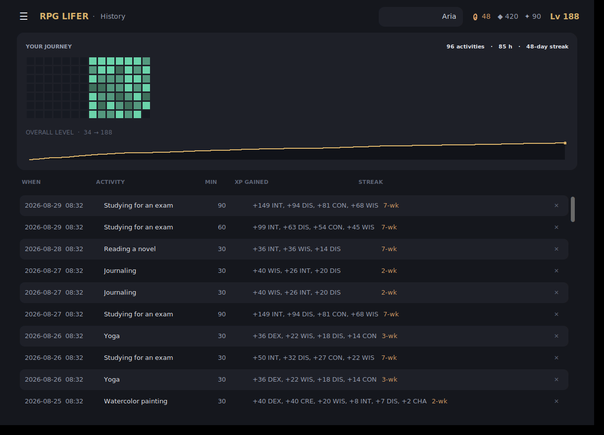
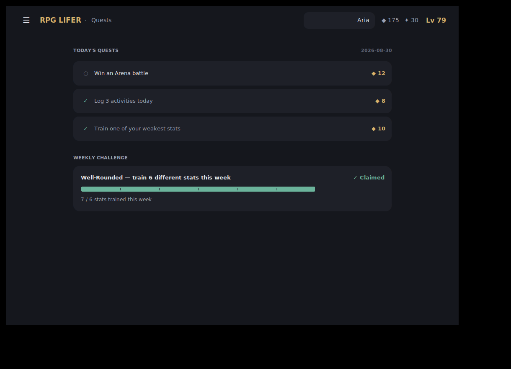
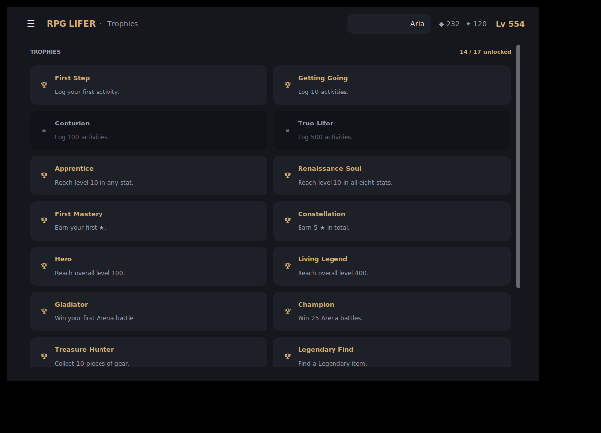
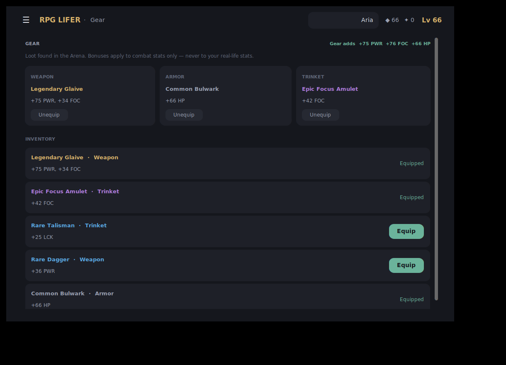
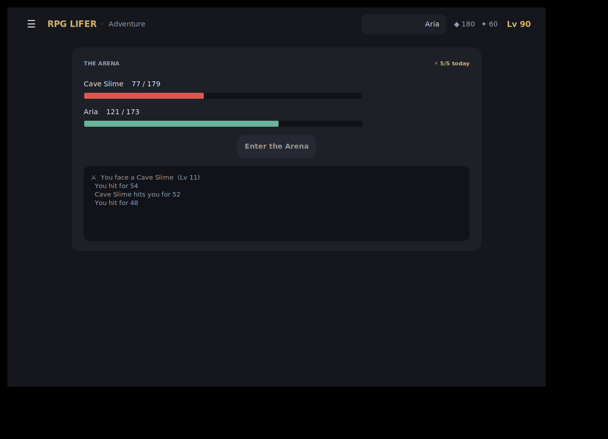
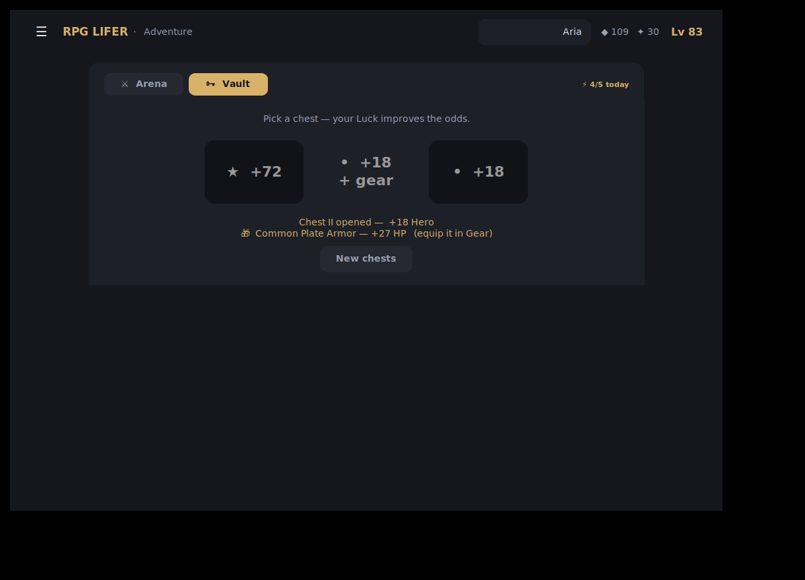
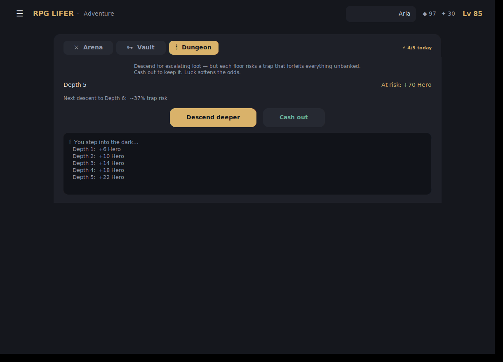
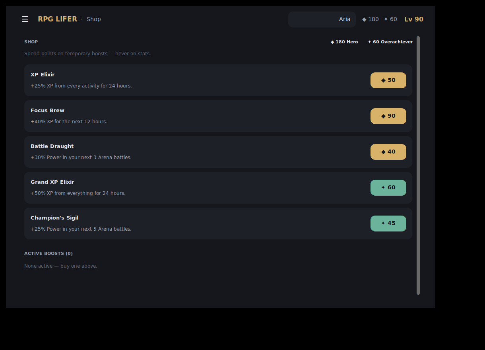

# ⚔️ RPG Lifer

**Turn the things you do every day into a leveling RPG character.**

Log real-life activities — a workout, the dishes, an hour of reading — and the
time you spend becomes experience that raises your stats. Over weeks and months
your character sheet becomes a portrait of how you actually spend your life. Do
nothing but lift weights? You'll be a walking pile of **Strength** with a
**Charisma** of 1. The character you build is the one you *earn*.



<p align="center">
  
  
</p>

---

## The idea

- **Eight stats that define you.** Strength, Agility, Endurance, Intellect,
  Wisdom, Charisma, **Discipline**, and **Creativity** — shown as a character
  **web (radar)** so your shape is obvious at a glance. Hover any stat to see
  what it means and how to raise it, or **click a stat** to open its full
  **title ladder** — a skill-tree of milestones from your first rank to mastery,
  with the best activities to train it.
- **A living character.** A hero **avatar in a level ring**, and a **class that
  evolves** with your two strongest stats (a *Steadfast Sage* today, an
  *Inventive Rogue* next month). Logging throws up a juicy **"+XP" burst**, and
  crossing a level or earning a title triggers a **celebration** with a gold
  particle burst.
- **Two stat layers.** The eight core stats are trained *only* by real
  activities. From them we compute **derived combat/shop stats** — Vitality,
  Power, Focus, Insight, Influence, Luck — which gear and adventures buff,
  keeping your real-life stats pure.
- **900+ activities, and every one is multi-stat.** From dishes and deadlifts to
  woodcarving, watercolor, photography, commuting, and public speaking — each
  activity feeds *several* stats at different amounts (watercolor: mostly Agility,
  some Wisdom and Creativity, a trace of Intellect). The full catalog lives in an
  editable data file you can keep growing.
- **Type-ahead search.** Start typing and the closest activities pop up even if
  you don't type the exact words — `dsh` → **Dishes**, `wrk` → **Strength
  workout**, `woodcut` → **Chopping firewood**.
- **A reward loop.** Earn **Hero points** (from level-ups, titles, ★s, and
  reaching outside your comfort zone) and **Overachiever points** (from a weekly
  *well-rounded* challenge). Spend them in the **Shop** on temporary boosts
  (never on stats), and play the **Adventure** mini-games — the **Arena**
  auto-battle (uses your derived combat stats), the **Treasure Vault** (pick a
  chest; your Luck skews the odds), and the **Dungeon Dive** (a push-your-luck
  descent: go deeper for escalating loot or cash out before a trap takes it
  all) — for Hero points and the **Gear** they drop. **Daily quests** and the
  weekly challenge give you goals that pay out.
- **A clean, sectioned interface.** Navigation lives behind a hamburger menu:
  **Character, Activities, Quests, Trophies, History, Shop, Adventure, Gear**.
  The **History** screen shows a journey heatmap and every session — and lets
  you **undo a mis-logged entry** (its XP is rolled back too).
- **Time → XP → levels.** Dedicate minutes to an activity; that time becomes XP,
  split across the activity's stats by weight. Each stat levels on its own
  curve — the first level is quick, but real growth takes *weeks* of dedication,
  by design.
- **Consistency pays.** A **daily streak** (shown as a flame in the top bar)
  counts every day you log *something* — miss a day and it resets, so there's
  always a reason to show up. On top of that, doing the *same* activity in
  back-to-back weeks earns a growing XP bonus (+10% per week, up to +50%).
- **Titles to chase.** Hit milestone levels in a stat and you earn a title —
  STR 10 → *Iron-Willed*, INT 10 → *Scholar*, WIS 20 → *Guru* — so every
  attribute is worth pushing on its own.
- **Your save is yours.** Everything is stored locally in a plain JSON file. No
  account, no cloud, no tracking.

## A tour

<p align="center">
  
  
  
</p>
<p align="center">
  
  
  
</p>
<p align="center">
  
</p>

## Get the Windows app (`.exe`)

You don't need Python to *run* the app — just a `.exe`.

**Option A — download a pre-built build (no tools needed).**
Every push builds on a Windows machine via GitHub Actions. Open the repo's
**Actions** tab → the latest **Build Windows EXE** run, then grab either
artifact at the bottom:

- **`RPGLifer-installer`** → an installer (`RPGLifer-Setup.exe`) that adds a
  Start-menu shortcut, an optional desktop shortcut, and an uninstall entry.
- **`RPGLifer-windows`** → the portable single-file `RPGLifer.exe` (no install;
  run from anywhere).

**Option B — build it yourself on Windows.**
Install [Python 3.9+](https://www.python.org/downloads/) (tick *"Add Python to
PATH"*), then double-click **`build.bat`**. When it finishes, your app is at
`dist\RPGLifer.exe` — copy it anywhere. (The installer is produced by
[Inno Setup](https://jrsoftware.org/isinfo.php) from
`packaging/installer.iss`.)

## Run from source (any OS)

```bash
pip install -r requirements.txt   # CustomTkinter (the GUI toolkit)
python run.py                     # launch the GUI
python run.py --cli               # text-mode interface (no display needed)
python -m rpglifer                # same as run.py
```

The GUI is built with [CustomTkinter](https://customtkinter.tomschimansky.com/)
for its soft, rounded, modern look; it's the only runtime dependency (Tkinter
itself ships with the official python.org installers). The `--cli` mode needs
nothing but the standard library.

## How XP and leveling work

Logging `minutes` of an activity grants `minutes × xp_per_minute` of base XP
(default **2**/min), divided among the activity's stats by their weights, then
scaled by your current consistency bonus. For example **Reading** is
`INT 0.8 / WIS 0.2`, so a 30-minute session (30 × 2 = 60 base XP) grants
**48 INT** and **12 WIS** — plus a streak bonus if you've been reading week
after week.

Each stat runs on a **0–100 mastery scale** with a deliberately **front-loaded**
curve — `level = 100 × (xp / XP_TO_MAX)^0.4` — so your first session is worth
several levels and the bar moves every time you log, then the climb slows toward
mastery. Reach **100** and the stat earns a **★** (prestige): the bar resets to 0
into a new star tier and keeps stacking (★1, ★2, …), so nothing is ever capped
and the fast early-levelling loop restarts each star. The capstone title is kept
and the ★ count becomes the prestige signal. Real numbers for one stat trained
**30 minutes a day**:

| Time in        | Stat level | Overall level* |
| -------------- | ---------: | -------------: |
| day 1          |          6 |              9 |
| week 1         |         13 |             21 |
| 1 month        |         26 |             41 |
| 3 months       |         43 |             68 |
| 6 months       |         58 |             91 |
| 1 year         |         78 |            122 |

\*Your **overall level** is the sum of every stat's *effective* level
(stars × 100 + level), so it climbs with *every* activity — and with prestige it
is **uncapped**, so there is always a number going up. Hitting **100** in a stat
is a real, multi-year goal for a single focused pursuit; `XP_TO_MAX` in
[`rpglifer/leveling.py`](rpglifer/leveling.py) is the one knob that makes
mastery faster or slower.

### Consistency streaks

Do an activity in consecutive **calendar weeks** and it builds a streak. Each
week beyond the first adds **+10% XP** for that activity, capped at **+50%**
(a 6-week streak). Miss a week and the streak resets. The app previews what
logging now would earn ("logging now makes it 3 weeks running: +20% XP") and
marks streak-boosted entries with 🔥.

### Titles

Reaching a milestone level in a stat unlocks a title — the highest one you've
reached is shown under the stat. Every stat has its own ladder (levels
10 / 25 / 40 / 55 / 75 / 100), so the first rank lands in week one and the last
is mastery. See [`rpglifer/titles.py`](rpglifer/titles.py) to tune them.

## Add your own activities

The catalog lives in [`rpglifer/data/activities.json`](rpglifer/data/activities.json)
(900+ entries and counting). Adding one is a single object:

```json
{
  "name": "Rock climbing",
  "category": "Outdoor & Adventure",
  "weights": { "STR": 0.5, "DEX": 0.45, "CON": 0.2, "WIS": 0.05 },
  "aliases": ["climbing", "bouldering"]
}
```

Weights are **independent multipliers** of the activity's base XP per stat (they
don't need to sum to 1), so an activity can pour a lot into one stat and a trace
into others. Weight keys must be valid stat keys from
[`rpglifer/stats.py`](rpglifer/stats.py) (a test enforces this). Search,
logging, suggestions, and the UI pick up new activities automatically.

## Where is my save?

A single `save.json`, in your user data directory:

| OS      | Location                                            |
| ------- | --------------------------------------------------- |
| Windows | `%APPDATA%\RPGLifer\save.json`                       |
| macOS   | `~/Library/Application Support/RPGLifer/save.json`   |
| Linux   | `~/.local/share/rpglifer/save.json`                 |

Set the `RPGLIFER_DATA_DIR` environment variable to override it. A corrupt save
is set aside as `save.corrupt-<timestamp>.json` rather than lost.

## Project layout

```
rpglifer/
  leveling.py           XP ↔ level math (pure functions)
  stats.py              the eight core stats (data-driven)
  titles.py             milestone titles unlocked per stat
  derived.py            combat/shop stats + evolving class, from core stats
  activities.py         loads + models the activity catalog
  data/activities.json  the 900+ activity catalog (editable)
  fuzzy.py              type-ahead / closest-match search
  recommend.py          "explore" suggestions + per-stat activity lookups
  economy.py            Hero / Overachiever point rules
  adventure.py          the Arena auto-battle engine (seedable, pure)
  ventures.py           the Treasure Vault chest game (seedable, pure)
  dungeon.py            the Dungeon Dive push-your-luck run (seedable, pure)
  shop.py               the Shop catalog + purchase logic
  character.py          the character model: XP, logging, streaks, points,
                        bonuses, prestige, save shape
  storage.py            where and how the save is written
  cli.py                text-mode front-end
  ui_tk.py              the gamified desktop GUI (CustomTkinter): radar,
                        level ring, class, XP bursts
  app.py                entry point (chooses GUI or CLI)
tests/                  unit tests for the whole core
packaging/              PyInstaller spec
run.py                  dev launcher & PyInstaller entry point
build.bat               one-click Windows build
```

The **core** (everything above `cli.py`) has no UI code, which is why it's
fully unit-tested and why front-ends can be swapped or added freely.

## Running the tests

```bash
python -m pytest -q
```

## Roadmap

Already in: the core, a Windows `.exe` **and installer** build, a **900+ multi-stat activity
catalog**, **eight core stats** with a radar/web and **clickable title ladders**,
**prestige stars**, **derived combat/shop stats** and an **evolving class**, a
**daily streak** plus per-activity **consistency streaks**, **milestone titles**,
a front-loaded 1–100 XP curve, a **points economy** (Hero + Overachiever), three
**Adventure** mini-games (the **Arena** auto-battle with foe archetypes +
**boss battles**, a **Treasure Vault**, and a **Dungeon Dive** push-your-luck
run) with **Gear/loot drops**, a working **Shop** of boosts and cosmetics,
**daily quests** + a **weekly well-rounded challenge** that shows what you still
need to train, **achievement trophies** with progress bars, **first-run
onboarding**, **one-tap quick-log**, **undo** for mis-logged entries, a one-click
**save backup**, a **journey heatmap** of your consistency, and a gamified GUI
(level ring, XP bursts, mastery celebrations, hamburger nav).

Planned next:

- **More Adventure content** — multi-encounter runs and more mini-games to join
  the Arena, Vault, and Dungeon Dive.
- **Signed builds** — code-sign the `.exe`/installer so Windows SmartScreen is
  friendlier.
- **More challenge types** — beyond the weekly well-rounded challenge.

## License

MIT.
